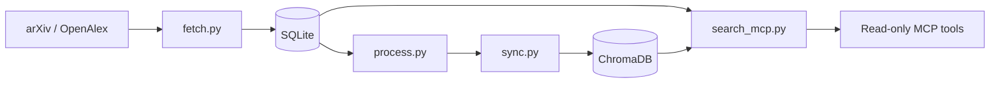

# Quant Research Vault

A local Python pipeline that retrieves configured academic-paper metadata, stores it in SQLite, indexes processed records in ChromaDB, and exposes read-only retrieval through an MCP server.

## Status & honesty

Active research-infrastructure project. No trading, predictive, or benchmark performance result is retained in this public checkout. In-sample result: UNKNOWN. Out-of-sample result: UNKNOWN. The exact scale of **18,492 papers** is UNKNOWN: no committed database, retained query output, or reproducible public corpus in this repository confirms it. Generated databases, vector indexes, PDFs, exports, and optional model outputs are local-only and intentionally ignored.

## Architecture

- `fetch.py` queries configured arXiv categories and optional OpenAlex; Semantic Scholar is configured but disabled by default. Records are persisted in SQLite using `INSERT OR IGNORE` keyed by paper ID.
- arXiv HTTP 429 retries use exponential waits of 60, 120, 240, and 480 seconds; HTTP 500 retries wait 30, 60, 90, and 120 seconds.
- `process.py` optionally enriches local records; `sync.py` indexes processed records in ChromaDB and skips IDs already present.
- `search_mcp.py` provides read-only semantic search and stats over ChromaDB/SQLite, with a temporary PID lock to reject another live MCP instance and clear stale locks.
- `run.py` orchestrates fetch → process → sync; `master.py` coordinates longer, restartable source and distillation stages.



## The interesting decision

The project decouples abstract-only indexing from optional full-text/model-assisted enrichment. This makes a locally retrieved corpus searchable before the slower enrichment stage; the trade-off is that early retrieval quality is limited to metadata and abstracts, while later enrichment requires local files and optional model tooling.

## Provenance

- arXiv and OpenAlex are the configured upstream metadata sources (`config.yaml`, `fetch.py`); their availability, coverage, licenses, and API limits remain upstream concerns.
- SQLite is the local state store and ChromaDB is the local vector index (`fetch.py`, `sync.py`, `search_mcp.py`).
- The MCP server is local and read-only with respect to the retrieval interface (`search_mcp.py`).
- Repository license: **UNKNOWN**. This checkout has no `LICENSE` file, and provenance/rights for every contribution and generated artifact were not established here.

## Run it

```bash
python -m venv .venv
.venv\Scripts\python -m pip install -r requirements.txt ruff mypy pytest
.venv\Scripts\ruff check .
.venv\Scripts\ruff format --check .
.venv\Scripts\mypy
.venv\Scripts\pytest -q
.venv\Scripts\python run.py --fetch-only --dry-run
.venv\Scripts\python search_mcp.py --help
```

The dry run makes live upstream requests but is intended not to persist fetched records. Run `python run.py --help` before any stateful ingestion command.

## Limitations

- No committed corpus, database, ChromaDB index, or result log permits independent verification of a paper count, coverage, retrieval quality, or any research performance claim.
- Upstream API schema, rate-limit, and availability changes can affect ingestion.
- The PID lock is a local single-instance guard, not a distributed lock.
- Optional enrichment depends on local files and model/tool configuration; it is not exercised by the clean-clone quality suite.
