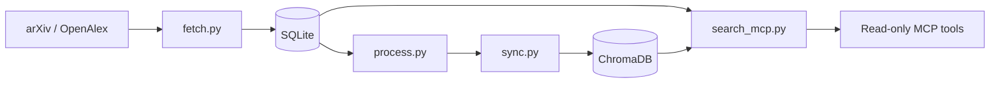

# Quant Research Vault

A local Python pipeline recorded 18,492 audit-time SQLite rows (sample status UNKNOWN), indexes processed academic-paper records in ChromaDB, and exposes read-only retrieval through an MCP server.

## Status & honesty

Active research-infrastructure project. An audit-time query returned **18,492 rows** from the local `papers` SQLite table; this is an operational row count, not a quality or model-performance result, and its sample status is UNKNOWN. The database is intentionally unpublished, so `docs/corpus_audit_snapshot_2026-07-30.json` records the exact queries, results, database size, and SHA-256 while marking the count non-reproducible from a public clone. No trading, predictive, retrieval-quality, or benchmark result is claimed.

## Architecture

- `fetch.py` queries configured arXiv categories and optional OpenAlex; Semantic Scholar is configured but disabled by default. Records are persisted in SQLite using `INSERT OR IGNORE` keyed by paper ID.
- arXiv HTTP 429 retries use exponential waits of 60, 120, 240, and 480 seconds; HTTP 500 retries wait 30, 60, 90, and 120 seconds.
- `process.py` optionally enriches local records; `sync.py` indexes processed records in ChromaDB and skips IDs already present.
- `search_mcp.py` provides read-only semantic search and stats over ChromaDB/SQLite, with a temporary PID lock to reject another live MCP instance and clear stale locks.
- `run.py` orchestrates fetch -> process -> sync; `master.py` coordinates longer, restartable source and distillation stages.



## The interesting decision

The project decouples abstract-only indexing from optional full-text/model-assisted enrichment. This makes a locally retrieved corpus searchable before the slower enrichment stage; the trade-off is that early retrieval quality is limited to metadata and abstracts, while later enrichment requires local files and optional model tooling.

## Provenance

- arXiv and OpenAlex are the configured upstream metadata sources (`config.yaml`, `fetch.py`); their availability, coverage, licenses, and API limits remain upstream concerns.
- SQLite is the local state store and ChromaDB is the local vector index (`fetch.py`, `sync.py`, `search_mcp.py`).
- The MCP server is local and read-only with respect to the retrieval interface (`search_mcp.py`).
- `docs/corpus_audit_snapshot_2026-07-30.json` records `SELECT count(*) FROM papers = 18492` against an ignored 33,161,216-byte SQLite file with SHA-256 `acb1a76ee2bf575fa083c807be39b66b34c040a6b9697a297b1e0dc0a0e7ab13`; the underlying rows are not published.
- Repository license: **UNKNOWN**. This checkout has no `LICENSE` file, and provenance/rights for every contribution and generated artifact were not established here.

## Run it

```powershell
python -m venv .venv
& .\.venv\Scripts\python.exe -m pip install -r requirements.txt ruff mypy pytest
& .\.venv\Scripts\ruff.exe check .
& .\.venv\Scripts\ruff.exe format --check .
& .\.venv\Scripts\mypy.exe
& .\.venv\Scripts\pytest.exe -q
& .\.venv\Scripts\python.exe run.py --fetch-only --dry-run
& .\.venv\Scripts\python.exe search_mcp.py --help
```

The dry run makes live upstream requests but is intended not to persist fetched records. Run `python run.py --help` before any stateful ingestion command.

## Limitations

- The committed audit snapshot preserves a local row count and source hash, but the corpus, SQLite database, and ChromaDB index are not published; the count, coverage, and retrieval quality are therefore not independently reproducible from this checkout.
- Upstream API schema, rate-limit, and availability changes can affect ingestion.
- The PID lock is a local single-instance guard, not a distributed lock.
- Optional enrichment depends on local files and model/tool configuration; it is not exercised by the clean-clone quality suite.
