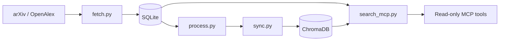

# Quant Research Vault: Local Paper Ingestion and Semantic Search over MCP

[](https://github.com/hihihhi/quant-research-vault/actions/workflows/quality.yml)

A local Python pipeline that fetches academic-paper metadata from arXiv (optionally OpenAlex) into SQLite, indexes processed records in ChromaDB, and exposes read-only semantic search through an MCP server. At a 2026-07-30 audit its local, unpublished database held 18,492 paper rows ([query and SHA-256](docs/corpus_audit_snapshot_2026-07-30.json)).

**Status:** arXiv-ID deduplication, non-overlapping fetch date windows, rate-limit backoff, the single-instance MCP lock and search-result mapping pass 5 offline tests; CI runs ruff, mypy and pytest.

Run the checks with `pytest -q` and see the MCP server's options with `python search_mcp.py --help`; PowerShell and bash steps are in [Run it](#run-it).

Implemented with AI coding agents under Oscar's design and review.

## Architecture

- `fetch.py` queries configured arXiv categories and optional OpenAlex; Semantic Scholar is configured but disabled by default. Records are persisted in SQLite using `INSERT OR IGNORE` keyed by paper ID.
- arXiv fetches make up to 4 attempts. After an HTTP 429 the waits are 60, 120 and 240 seconds before the retries (and 480 seconds before giving up); after an HTTP 500 they are 30, 60 and 90 seconds (and 120 before giving up).
- `process.py` optionally enriches local records; `sync.py` indexes processed records in ChromaDB and skips IDs already present.
- `search_mcp.py` provides read-only semantic search and stats over ChromaDB/SQLite, with a temporary PID lock to reject another live MCP instance and clear stale locks.
- `run.py` orchestrates fetch -> process -> sync; `master.py` coordinates longer, restartable source and distillation stages.


```mermaid
flowchart LR
  A[arXiv / OpenAlex] --> B[fetch.py]
  B --> C[(SQLite)]
  C --> D[process.py]
  D --> E[sync.py]
  E --> F[(ChromaDB)]
  C --> G[search_mcp.py]
  F --> G
  G --> H[Read-only MCP tools]
```

## The interesting decision

The project decouples abstract-only indexing from optional full-text/model-assisted enrichment. This makes a locally retrieved corpus searchable before the slower enrichment stage; the trade-off is that early retrieval quality is limited to metadata and abstracts, while later enrichment requires local files and optional model tooling.

## Provenance

- arXiv and OpenAlex are the configured upstream metadata sources (`config.yaml`, `fetch.py`); their availability, coverage, licenses, and API limits remain upstream concerns.
- SQLite is the local state store and ChromaDB is the local vector index (`fetch.py`, `sync.py`, `search_mcp.py`).
- The MCP server is local and read-only with respect to the retrieval interface (`search_mcp.py`).
- `docs/corpus_audit_snapshot_2026-07-30.json` records `SELECT count(*) FROM papers = 18492` against an ignored 33,161,216-byte SQLite file with SHA-256 `acb1a76ee2bf575fa083c807be39b66b34c040a6b9697a297b1e0dc0a0e7ab13`; the underlying rows are not published.
- Implemented with AI coding agents (OpenAI Codex, Claude Code) under Oscar Choi's design and review.
- Research-infrastructure project; last functional change 2026-04-12.
- Repository license: MIT (see `LICENSE`).

## Run it

```powershell
python -m venv .venv
& .\.venv\Scripts\python.exe -m pip install -r requirements.txt ruff mypy pytest
& .\.venv\Scripts\ruff.exe check .
& .\.venv\Scripts\ruff.exe format --check .
& .\.venv\Scripts\mypy.exe
& .\.venv\Scripts\pytest.exe -q
& .\.venv\Scripts\python.exe run.py --fetch-only --dry-run
& .\.venv\Scripts\python.exe search_mcp.py --help
```

```bash
# macOS/Linux (bash): the same steps
python3.11 -m venv .venv
.venv/bin/python -m pip install -r requirements.txt ruff mypy pytest
.venv/bin/ruff check .
.venv/bin/ruff format --check .
.venv/bin/mypy
.venv/bin/pytest -q
.venv/bin/python run.py --fetch-only --dry-run
.venv/bin/python search_mcp.py --help
```

The dry run makes live upstream requests but is intended not to persist fetched records. Run `python run.py --help` before any stateful ingestion command.

## Limitations

- The 18,492-row audit-time count is an operational row count, not a quality or model-performance result, and its sample status is unknown; the code's `processed` flag means an entry was written, not that analysis is complete. No trading, predictive, retrieval-quality, or benchmark result is claimed.
- The committed audit snapshot preserves a local row count and source hash, but the corpus, SQLite database, and ChromaDB index are not published; the count, coverage, and retrieval quality are therefore not independently reproducible from this checkout.
- Upstream API schema, rate-limit, and availability changes can affect ingestion.
- The PID lock is a local single-instance guard, not a distributed lock.
- Optional enrichment depends on local files and model/tool configuration; it is not exercised by the clean-clone quality suite.
