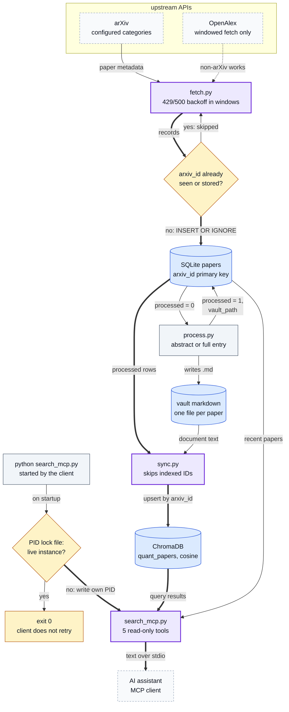
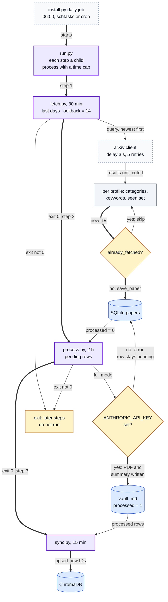

# Quant Research Vault: Local Paper Ingestion and Semantic Search over MCP

[](https://github.com/oscar-chw/quant-research-vault/actions/workflows/quality.yml)

A local Python pipeline that fetches academic-paper metadata from arXiv (optionally OpenAlex) into SQLite, indexes processed records in ChromaDB, and exposes read-only semantic search through an MCP server, so an AI assistant can search a quant-finance paper corpus.
At a 2026-07-30 audit its local, unpublished database held 18,492 paper rows ([what that count rests on](docs/corpus-audit.md)).
Deduplication, fetch windows, rate-limit backoff, the single-instance MCP lock and search-result mapping pass 10 offline tests.

From upstream metadata to an AI assistant's search: deduplicated into SQLite, written to the vault, indexed in
ChromaDB, and served read-only over MCP by a single server instance.


```mermaid
flowchart TB
    subgraph up["upstream APIs"]
        ARX["arXiv<br/>configured categories"]
        OA["OpenAlex<br/>windowed fetch only"]
    end
    FETCH["fetch.py<br/>429/500 backoff in windows"]
    DD{"arxiv_id already<br/>seen or stored?"}
    DB[("SQLite papers<br/>arxiv_id primary key")]
    PROC["process.py<br/>abstract or full entry"]
    VAULT[("vault markdown<br/>one file per paper")]
    SYNC["sync.py<br/>skips indexed IDs"]
    CH[("ChromaDB<br/>quant_papers, cosine")]
    START["python search_mcp.py<br/>started by the client"]
    LOCK{"PID lock file:<br/>live instance?"}
    EXIT["exit 0<br/>client does not retry"]
    MCP["search_mcp.py<br/>5 read-only tools"]
    AI["AI assistant<br/>MCP client"]

    ARX -- "paper metadata" --> FETCH
    OA -. "non-arXiv works" .-> FETCH
    FETCH == "records" ==> DD
    DD -- "yes: skipped" --> FETCH
    DD == "no: INSERT OR IGNORE" ==> DB
    DB -- "processed = 0" --> PROC
    PROC -- "writes .md" --> VAULT
    PROC -- "processed = 1,<br/>vault_path" --> DB
    DB == "processed rows" ==> SYNC
    VAULT -- "document text" --> SYNC
    SYNC == "upsert by arxiv_id" ==> CH
    START -- "on startup" --> LOCK
    LOCK -- "yes" --> EXIT
    LOCK == "no: write own PID" ==> MCP
    CH == "query results" ==> MCP
    DB -- "recent papers" --> MCP
    MCP == "text over stdio" ==> AI

    classDef data fill:#dbeafe,stroke:#1d4ed8,color:#0b1220
    classDef step fill:#f1f5f9,stroke:#475569,color:#0b1220
    classDef gate fill:#fef3c7,stroke:#b45309,color:#0b1220
    classDef ext  fill:#f8fafc,stroke:#94a3b8,color:#0b1220,stroke-dasharray:4 3
    classDef key  fill:#ede9fe,stroke:#6d28d9,color:#0b1220,stroke-width:2px
    class DB,VAULT,CH data
    class PROC,START step
    class DD,LOCK,EXIT gate
    class ARX,OA,AI ext
    class FETCH,SYNC,MCP key
```

Where in the code: `fetch.py` (`fetch_recent`, `fetch_window`, `_iter_with_retry`, `fetch_openalex_window`,
`already_fetched`, `save_paper`), `process.py` (`get_pending`, `mark_processed`), `sync.py` (`already_indexed`,
`index_paper`), `search_mcp.py` (`_acquire_lock`, `build_server`), `config.yaml`.

## Why this exists

Reading the quant-finance literature from an AI assistant needs a corpus the assistant can search locally: papers
fetched once, deduplicated, kept on disk, and served read-only by a single server instance.

## Approach

- `fetch.py` queries configured arXiv categories and optional OpenAlex and stores records in SQLite with `INSERT OR IGNORE` keyed by paper ID; the windowed history fetch backs off after HTTP 429 and 500 responses ([waits](docs/architecture.md#what-each-stage-does)).
- `process.py` writes one vault markdown entry per paper, abstract-only by default; full analysis is optional (Anthropic API key, or Claude Code with [docs/analysis-skill.md](docs/analysis-skill.md)).
- `sync.py` indexes processed entries in ChromaDB and skips IDs already present.
- `search_mcp.py` serves five read-only tools (search, recent papers, one paper, alpha ideas, stats) over stdio, with a PID lock that rejects a second live instance ([one search call, step by step](docs/architecture.md#one-search-call)).
- Design decision: abstract-only indexing is decoupled from optional full-text, model-assisted enrichment, so the corpus is searchable before the slower enrichment stage; the trade-off is that early retrieval quality is limited to metadata and abstracts.

The daily job: `install.py` schedules `run.py` at 06:00, which runs three child processes in order and stops at the
first that fails. The daily fetch is the last 14 days through the arXiv client's own retries; the 429/500 backoff
above applies to the windowed history fetch (`run.py --all-history`).


```mermaid
flowchart TB
    SCHED["install.py daily job<br/>06:00, schtasks or cron"]
    RUN["run.py<br/>each step a child<br/>process with a time cap"]
    F["fetch.py, 30 min<br/>last days_lookback = 14"]
    API["arXiv client<br/>delay 3 s, 5 retries"]
    FILT["per profile: categories,<br/>keywords, seen set"]
    NEW{"already_fetched?"}
    DB[("SQLite papers")]
    P["process.py, 2 h<br/>pending rows"]
    KEY{"ANTHROPIC_API_KEY<br/>set?"}
    MD[("vault .md<br/>processed = 1")]
    S["sync.py, 15 min"]
    CH[("ChromaDB")]
    STOP["exit: later steps<br/>do not run"]

    SCHED == "starts" ==> RUN
    RUN == "step 1" ==> F
    F -- "query, newest first" --> API
    API -- "results until cutoff" --> FILT
    FILT == "new IDs" ==> NEW
    NEW -- "yes: skip" --> FILT
    NEW == "no: save_paper" ==> DB
    F -- "exit not 0" --> STOP
    F == "exit 0: step 2" ==> P
    DB -- "processed = 0" --> P
    P -- "full mode" --> KEY
    KEY == "yes: PDF and<br/>summary written" ==> MD
    KEY -- "no: error,<br/>row stays pending" --> DB
    P -- "exit not 0" --> STOP
    P == "exit 0: step 3" ==> S
    MD -- "processed rows" --> S
    S == "upsert new IDs" ==> CH

    classDef data fill:#dbeafe,stroke:#1d4ed8,color:#0b1220
    classDef step fill:#f1f5f9,stroke:#475569,color:#0b1220
    classDef gate fill:#fef3c7,stroke:#b45309,color:#0b1220
    classDef ext  fill:#f8fafc,stroke:#94a3b8,color:#0b1220,stroke-dasharray:4 3
    classDef key  fill:#ede9fe,stroke:#6d28d9,color:#0b1220,stroke-width:2px
    class DB,MD,CH data
    class FILT step
    class NEW,KEY,STOP gate
    class SCHED,API ext
    class RUN,F,P,S key
```

Where in the code: `install.py` (`create_scheduled_task`), `run.py` (`run_step`, `_STEP_TIMEOUT`, `main`),
`fetch.py` (`fetch_recent`, `already_fetched`, `save_paper`), `process.py` (`_process_one`, `summarize`),
`sync.py` (`main`), `config.yaml` (`days_lookback`).

## Results

| What | Result | Evidence |
| --- | --- | --- |
| Offline tests | 10 pass: arXiv-ID deduplication, non-overlapping fetch windows, rate-limit backoff, single-instance lock, search-result mapping, MCP database path, installer refusing a malformed `~/.claude.json`, arXiv version-suffix normalisation | [test_quality.py](test_quality.py) |
| CI | ruff, ruff format, mypy and pytest on every push and pull request | [quality.yml](.github/workflows/quality.yml) |
| Corpus size | 18,492 paper rows in the local SQLite database at the 2026-07-30 audit; an operational count, not a quality result; not reproducible from this checkout | [docs/corpus-audit.md](docs/corpus-audit.md) |
| Retrieval quality, trading or predictive results | none claimed; no benchmark | none |

## Quick start

```bash
python3.11 -m venv .venv
.venv/bin/python -m pip install -r requirements.txt ruff mypy pytest
.venv/bin/ruff check . && .venv/bin/mypy   # lint and type checks, as in CI
.venv/bin/pytest -q                        # expect: 10 passed
.venv/bin/python run.py --fetch-only --dry-run   # live upstream requests, not persisted
.venv/bin/python search_mcp.py --help      # the MCP server's options
```

`install.py` registers the MCP server in `~/.claude.json`. If that file is not valid JSON the installer stops, leaves it
untouched and copies it to `.claude.json.malformed-<timestamp>.bak` next to it; fix or restore it and re-run.

The dry run makes live upstream requests but is intended not to persist fetched records; run `python run.py --help`
before any stateful ingestion command. PowerShell steps are in [docs/running.md](docs/running.md).

## Project structure

The Python modules sit flat at the root on purpose: imports, tests, CI and the install scripts depend on that layout.

```text
Pipeline                run.py runs fetch -> process -> sync, each a child process
  fetch.py              arXiv / OpenAlex metadata into SQLite, deduplicated by paper ID
  process.py            one vault markdown entry per paper (abstract-only or full)
  sync.py               indexes processed entries into ChromaDB
  master.py             longer, restartable build stages (sources, analysis, distillation)
Search and research
  search_mcp.py         read-only MCP server over ChromaDB and SQLite (five tools)
  research.py           command-line search, stats, related papers, export
Optional full analysis  driven by Claude Code with docs/analysis-skill.md
  list_pending.py       abstract-only entries still pending, as JSON
  mark_analyzed.py      records that a paper has been fully analysed
Setup and checks
  install.py, install.sh, install.ps1   dependencies, vault folders, MCP registration (install.py: daily job)
  doctor.py             installation self-check (database, index, MCP registration)
  test_quality.py       offline tests (pytest)
config.yaml             sources, categories, profiles, days_lookback
scripts/                generate-copilot-context.py: a Copilot-compatible summary of the vault
docs/                   architecture, analysis instructions, corpus audit, run steps
```

Docs: see [docs/README.md](docs/README.md).

## Limits

- The 18,492-row count is an operational row count, not a quality or model-performance result; the `processed` flag means an entry was written, not that analysis is complete. No trading, predictive, retrieval-quality or benchmark result is claimed.
- The corpus, SQLite database and ChromaDB index are not published, so the count, coverage and retrieval quality are not independently reproducible from this checkout.
- Upstream API schema, rate-limit and availability changes can affect ingestion.
- The PID lock is a local single-instance guard, not a distributed lock.
- Optional enrichment depends on local files and model/tool configuration; it is not exercised by the clean-clone quality suite.
- Research-infrastructure project; last functional change 2026-04-12.

## Lessons

- Decoupling abstract-only indexing from enrichment makes a corpus searchable before the slow stage finishes; the price is that early retrieval is only as good as metadata and abstracts.
- A row count is an operational number, not evidence of quality: committing the query and the file hash is as far as an unpublished database can be checked.

## Credits and licence

- arXiv and OpenAlex are the configured upstream metadata sources (`config.yaml`, `fetch.py`); their availability, coverage, licences and API limits remain upstream concerns.
- SQLite is the local state store and ChromaDB the local vector index; the MCP server is local and read-only with respect to retrieval.
- Licence: MIT ([LICENSE](LICENSE)).

Implemented with AI coding agents under Oscar's design and review. The agents were OpenAI Codex and Claude Code.
