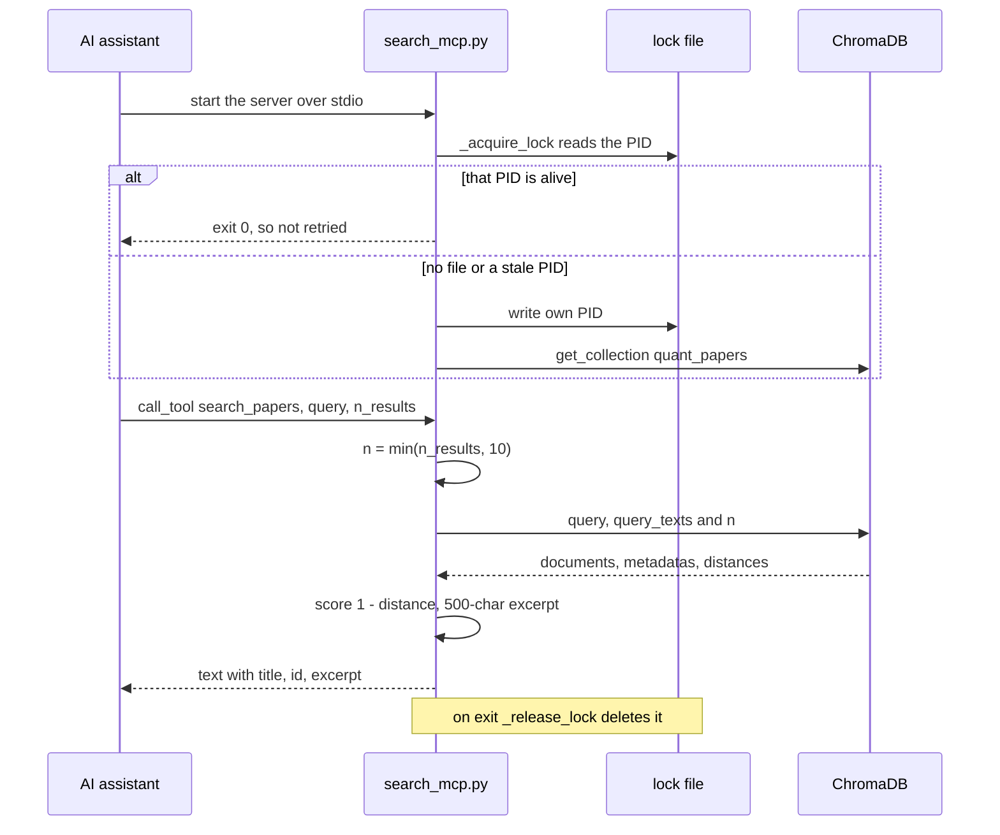

# Architecture: modules, retries and the MCP search path

## What each stage does

- `fetch.py` queries configured arXiv categories and optional OpenAlex; Semantic Scholar is configured but disabled by default. Records are persisted in SQLite using `INSERT OR IGNORE` keyed by paper ID.
- In the windowed history fetch (`--all-history`, `fetch_window`), arXiv requests make up to 4 attempts. After an HTTP 429 the waits are 60, 120 and 240 seconds before the retries (and 480 seconds before giving up); after an HTTP 500 they are 30, 60 and 90 seconds (and 120 before giving up).
- `process.py` optionally enriches local records; `sync.py` indexes processed records in ChromaDB and skips IDs already present.
- `search_mcp.py` provides read-only semantic search and stats over ChromaDB/SQLite, with a temporary PID lock to reject another live MCP instance and clear stale locks.
- `run.py` orchestrates fetch -> process -> sync; `master.py` coordinates longer, restartable source and distillation stages.

## One search call

One `search_papers` call, from server start to the text the assistant reads:

Where in the code: `search_mcp.py` (`_acquire_lock`, `_release_lock`, `get_collection`, `search_papers`,
`call_tool` in `build_server`); the lock and result mapping are covered by `test_quality.py`.

The daily scheduled job (fetch, process, sync) is drawn in the [README](../README.md#approach).
